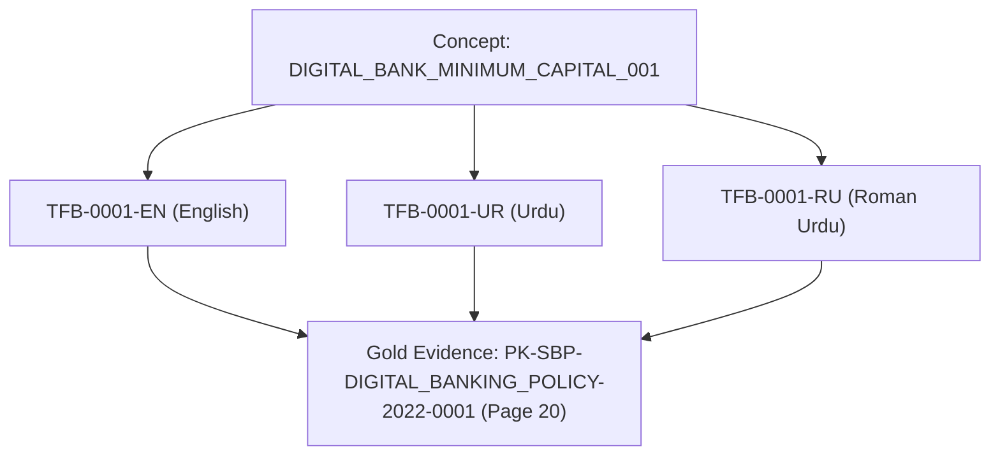

# FinUrdu Multilingual Retrieval Benchmark Specification (v0.1 Pilot)

## 1. Research Purpose

The **FinUrdu Multilingual Retrieval Benchmark** is designed to evaluate cross-lingual financial information access across Pakistani regulatory and financial literature. Future research utilizing this benchmark infrastructure will investigate:

- **RQ1**: How does retrieval performance differ across English, Urdu, and Roman Urdu financial queries?
- **RQ2**: How effectively can cross-lingual retrieval locate English-source financial evidence when the query is written in Urdu or Roman Urdu?
- **RQ3 (Future)**: How do sparse (BM25), dense (embeddings/vector indices), and hybrid retrieval methods compare when retrieving cross-lingual financial evidence?

> [!NOTE]
> Phase 2A establishes benchmark design, unit schemas, gold evidence annotation, manual semantic review, and automated validation ONLY. No retrieval experiments or answer generation models are evaluated during this phase.

---

## 2. Scope & Corpus Reality

The pilot benchmark grounds gold evidence exclusively within the trusted State Bank of Pakistan (SBP) regulatory page corpus (`data/processed/sbp/sbp_pages.jsonl`).

- **Corpus Language**: The source corpus is English-medium SBP regulatory documents.
- **Cross-Lingual Information Access**: All queries—whether authored in **English**, **Urdu**, or **Roman Urdu**—target underlying **English-medium source evidence**.
- **No Synthetic Translation of Corpus**: The source corpus is NOT translated into Urdu or Roman Urdu, preserving real-world cross-lingual retrieval dynamics where Pakistani banking consumers and compliance analysts query English regulatory material using native scripts or Roman Urdu transliteration.

---

## 3. Multilingual Design & Concept Alignment

The benchmark enforces a **concept-aligned triad structure**:

- **Information-Need Concept (`concept_id`)**: A unique financial or regulatory question topic (e.g. `DIGITAL_BANK_MINIMUM_CAPITAL_001`).
- **Language Triad**: Every concept consists of exactly 3 aligned query records:
  1. `ENGLISH` (Latin script)
  2. `URDU` (Arabic script)
  3. `ROMAN_URDU` (Latin script)
- **Natural Phrasing**: Queries sound natural and idiomatically authentic for Pakistani users rather than word-for-word mechanical translations.

---

## 4. Benchmark Unit Schema

Each query record in `data/benchmarks/finurdu_pilot_v0_1.jsonl` follows the explicit `BenchmarkRecord` Pydantic model:

| Field | Type | Description |
| :--- | :--- | :--- |
| `benchmark_id` | `str` | Deterministic item ID (`TFB-XXXX-EN`, `TFB-XXXX-UR`, `TFB-XXXX-RU`) |
| `concept_id` | `str` | Aligned information-need concept identifier |
| `query_text` | `str` | Natural query string in specified language and script |
| `query_language` | `Enum` | `ENGLISH`, `URDU`, or `ROMAN_URDU` |
| `query_script` | `Enum` | `LATIN` or `ARABIC` |
| `query_type` | `Enum` | Intent taxonomy classification |
| `difficulty` | `Enum` | `EASY`, `MEDIUM`, or `HARD` |
| `expected_document_ids` | `List[str]` | List of target SBP document IDs containing gold evidence |
| `relevant_pages` | `List[int]` | 1-based page numbers in source document |
| `evidence_spans` | `List[EvidenceSpan]` | Verbatim text extracts with page provenance |
| `answerability` | `Enum` | `ANSWERABLE` or `UNANSWERABLE` |
| `notes` | `Optional[str]` | Annotator and research notes |

---

## 5. Gold Evidence & Evidence Span Policy

Gold truth is anchored strictly to **DOCUMENT + PAGE** provenance rather than generated chunk IDs. This allows stable evaluation across multiple chunking strategies (e.g., `page_v1`, `fixed_300w_50o_v1`, `page_aware_300w_50o_v1`).

### Evidence Span & Sufficiency Policy
1. **Verbatim Text**: Every `verbatim_text` must exist character-for-character inside the `normalized_text` of the referenced document and page in `sbp_pages.jsonl`. Automated code validates string existence.
2. **Semantic Sufficiency**: Automated string validation alone does not guarantee relevance. Each evidence span undergoes **manual semantic review** to ensure it contains complete evidence required to answer the query (e.g., table values or exact condition rules).
3. **No Paraphrasing**: Gold evidence spans must never be paraphrased or fabricated.

---

## 6. Answerability Policy

- **`ANSWERABLE`**: Query information need is explicitly answered by one or more pages in the trusted SBP corpus.
- **`UNANSWERABLE`**: Query represents a plausible financial question for which the **current 4-document pilot corpus lacks evidence** (e.g., cryptocurrency exchange licensing or microfinance statutory interest rate caps).

> [!IMPORTANT]
> `UNANSWERABLE` items indicate that the question cannot be answered **from this specific corpus**, NOT that no real-world regulatory answer exists in Pakistani financial law generally. Unanswerable items have empty document IDs, page lists, and evidence spans (`expected_document_ids = []`, `relevant_pages = []`, `evidence_spans = []`).

---

## 7. Operational Difficulty Rubric

| Difficulty | Criteria |
| :--- | :--- |
| `EASY` | Explicit evidence concentrated on a single page using direct terminology matching query keywords. |
| `MEDIUM` | Evidence distributed across nearby sections or requiring terminology translation/mapping across languages. |
| `HARD` | Cross-document evidence, complex table parsing, or high lexical overlap with misleading sections. |

---

## 8. Query Intent Taxonomy

- `FACTUAL`: Specific factual lookup (e.g., account limits, form names).
- `DEFINITIONAL`: Regulatory or financial concept definitions.
- `PROCEDURAL`: Step-by-step compliance or account opening steps.
- `ELIGIBILITY`: Qualification criteria for account types or digital bank licenses.
- `LIMIT_OR_THRESHOLD`: Quantitative caps, minimum capital, or turn-around times.
- `REGULATORY_REQUIREMENT`: Mandatory compliance duties for financial institutions.
- `COMPARATIVE`: Differences between licensing classes or account types.
- `DOCUMENT_NAVIGATION`: Locating specific regulatory annexes or circular sections.

---

## 9. Validation & Review Framework

Benchmark integrity relies on a dual-layer verification protocol:

1. **Automated Validation (`scripts/validate_benchmark.py`)**: Checks unique IDs, schema compliance, verbatim text substring existence, document/page ID bounds, script encodings, and mandatory coverage of all 4 trusted SBP documents.
2. **Manual Semantic Review**: Verifies that every stored evidence span is semantically sufficient to answer the query, and confirms cross-lingual semantic equivalence across EN, UR, and RU variants.

---

## 10. Limitations & Scope Disclaimer

> [!WARNING]
> Current FinUrdu v0.1 is a small SBP pilot research benchmark (12 concepts, 36 queries) designed to establish validation infrastructure and cross-lingual methodology. It is **NOT** claimed to represent the full Pakistani financial domain or complete SBP regulatory corpus.

---

## 11. Future Expansion Path

- **Expansion to 100+ Concepts**: Scaling concept coverage across broader SBP circulars, SECP regulations, and commercial banking terms.
- **Multi-Page Evidence**: Supporting complex multi-document reasoning tasks.
- **Retrieval Baseline Benchmarking**: Evaluating BM25, dense embeddings, and cross-encoder rerankers against FinUrdu v0.1.
